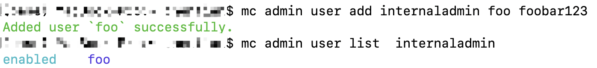
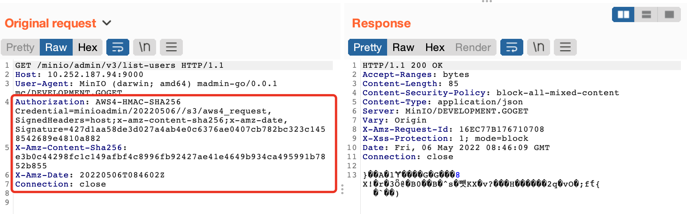
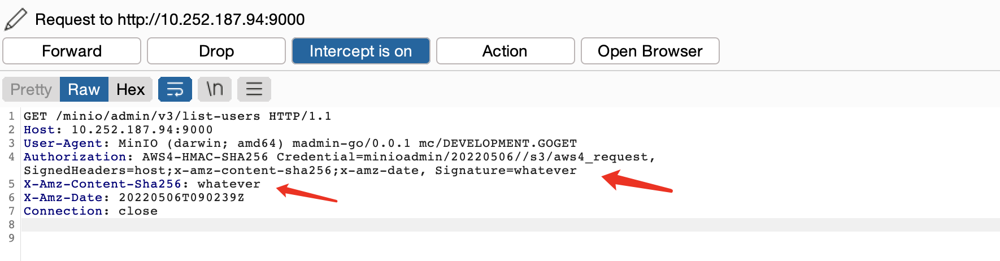
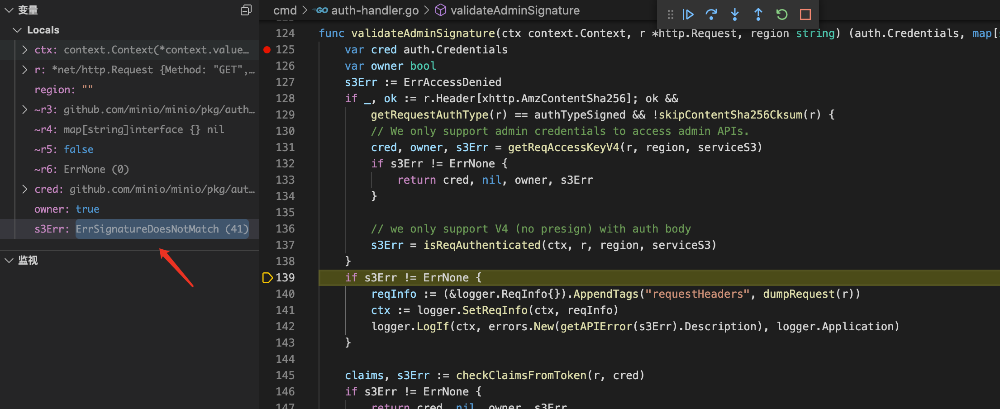
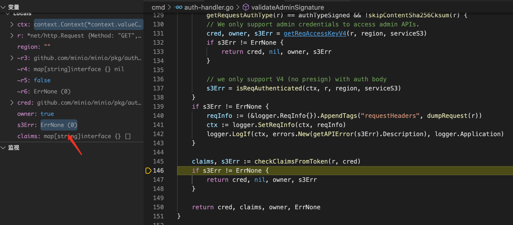
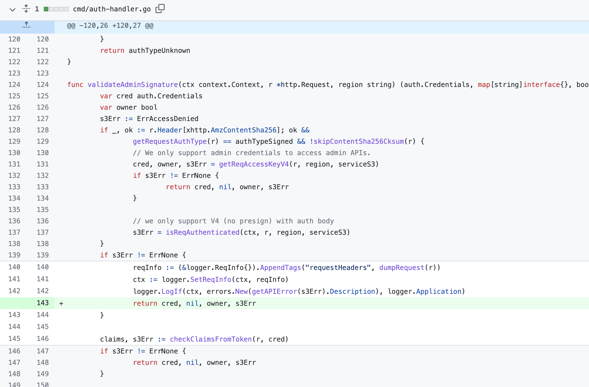

# CVE-2020-11012 prev

## 漏洞信息
- 漏洞类型：垂直越权
- 漏洞版本：RELEASE.2019-12-17T23-16-33Z to RELEASE.2020-04-23T00-58-49Z(excluded)
- 漏洞介绍：没有在处理异常以后正确返回，导致权限绕过

## 漏洞分析
这里在本地进行调试分析，选取的源代码tag为`minio-RELEASE.2020-04-15T19-42-18Z`，在漏洞版本之前。执行下面的指令启动服务器
```yaml
go run main.go server ./data
```
首先在本地用[mc](https://docs.min.io/docs/minio-client-quickstart-guide.html)创建一个管理员`host`

```yaml
mc config host add internaladmin http://10.252.187.94:9000  minioadmin minioadmin
```
然后使用这个`host`添加一个用户，这里用到了`mc admin`指令，进行管理员权限的操作
```yaml
mc admin user add internaladmin foo foobar123
```
下面使用查询用户的请求来验证漏洞，这里也用到了`mc admin`指令，进行管理员权限的操作
```yaml
mc admin user list internaladmin
```
正常发送请求，显示结果如下，说明成功以管理员权限查询出了用户



使用burp抓包拦截这个请求，可以看到请求头里面包含管理员的`accessKey`（即用户名），地区，时间戳，请求签名等信息



下面从漏洞代码位置进行分析。漏洞代码出现在[cmd/auth-handler.go](https://github.com/minio/minio/pull/9422/commits/b7ff67a15bf0ca63667a5133964e15b5d0ece05e#diff-da28a0c0b4e726eabd4cc316dedb9d6e86e2dfff586047857aa43864cdebb0d5)，在这里打上断点，使用[mc](https://docs.min.io/docs/minio-client-quickstart-guide.html)发送请求，用burp抓包拦截

```go
func validateAdminSignature(ctx context.Context, r *http.Request, region string) (auth.Credentials, map[string]interface{}, bool, APIErrorCode) {
	var cred auth.Credentials
	var owner bool
	s3Err := ErrAccessDenied
	if _, ok := r.Header[xhttp.AmzContentSha256]; ok &&
		getRequestAuthType(r) == authTypeSigned && !skipContentSha256Cksum(r) {
		// We only support admin credentials to access admin APIs.
		cred, owner, s3Err = getReqAccessKeyV4(r, region, serviceS3)
		if s3Err != ErrNone {
			return cred, nil, owner, s3Err
		}

		// we only support V4 (no presign) with auth body
		s3Err = isReqAuthenticated(ctx, r, region, serviceS3)
	}
	if s3Err != ErrNone {
		reqInfo := (&logger.ReqInfo{}).AppendTags("requestHeaders", dumpRequest(r))
		ctx := logger.SetReqInfo(ctx, reqInfo)
		logger.LogIf(ctx, errors.New(getAPIError(s3Err).Description), logger.Application)
	}

	claims, s3Err := checkClaimsFromToken(r, cred)
	if s3Err != ErrNone {
		return cred, nil, owner, s3Err
	}

	return cred, claims, owner, ErrNone
}
```
这里将用来验证管理员身份的签名信息修改为任意值



通过请求，断点断下。这里我们发现，在通过`isReqAuthenticated`函数后，判断签名错误，返回了Error，但是并没有退出



继续向下，通过`checkClaimsFromToken`函数，返回的Error为空，将上面判断的Error覆盖，所以函数最终返回的Error也为空



Error变量的重用和覆盖导致校验最终失效

## 修复方式
在发现签名后，立即返回



## 参考链接
- https://github.com/minio/minio/security/advisories/GHSA-xv4r-vccv-mg4w