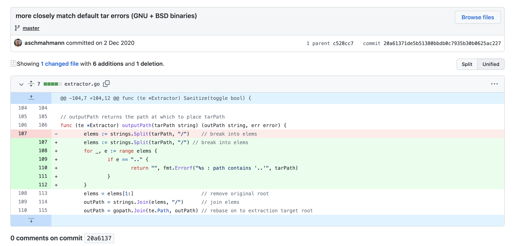
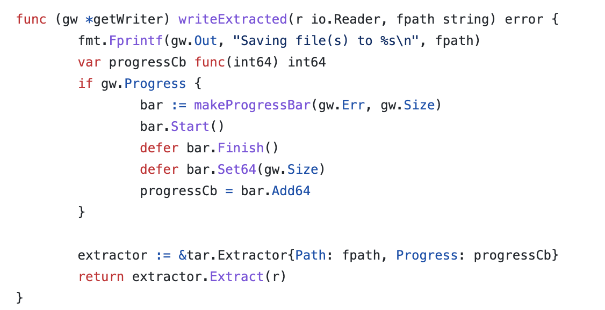
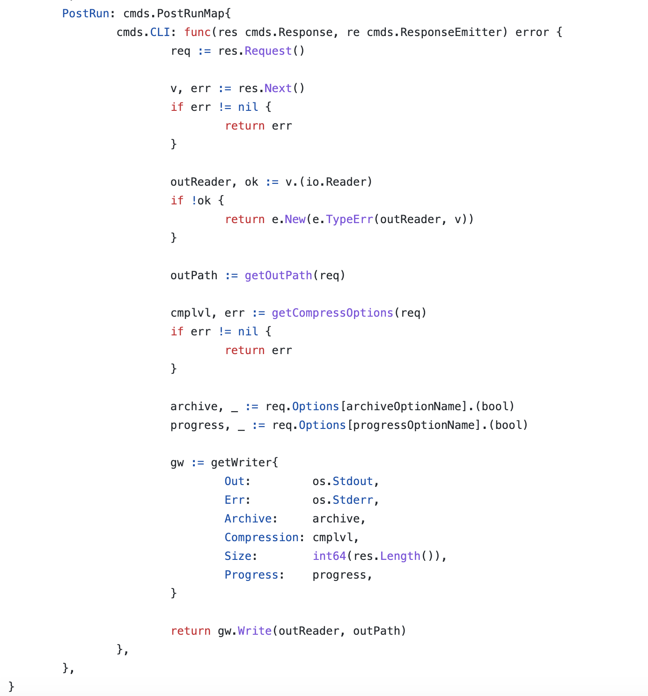
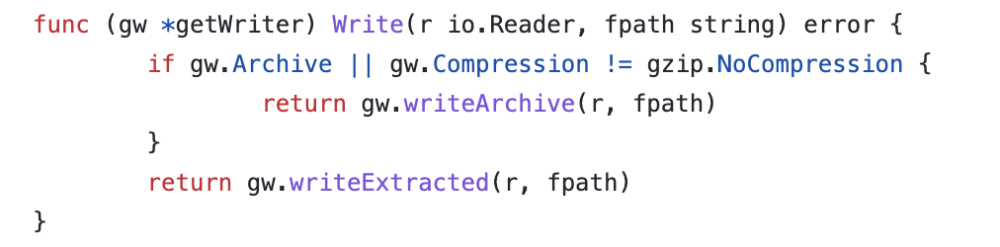

# CVE-2020-26279 go-ipfs path traversal

## 漏洞信息

- 漏洞类型：目录遍历

- 漏洞版本：<v0.8.0-rc1
- 漏洞简介：下载文件自动解压时导致目录遍历

## repo介绍
go-ipfs是一个go语言实现的文件服务器，目前在github上已经有13.3k个star。

## 漏洞分析

使用的一个叫做[tar-utils](https://github.com/whyrusleeping/tar-utils/commit/20a61371de5b51380bbdb0c7935b30b0625ac227)的依赖库出现了问题，没有检测`../`



调用链为`Extract`

```go
func (te *Extractor) Extract(reader io.Reader) error {
	if isNullDevice(te.Path) {
		return nil
	}

	tarReader := tar.NewReader(reader)

  ...

	// files come recursively in order (i == 0 is root directory)
	for i := 0; ; i++ {
		header, err := tarReader.Next()

    ...

		switch header.Typeflag {
		case tar.TypeDir:
			if err := te.extractDir(header, i); err != nil {
				return err
			}
		case tar.TypeReg:
			if err := te.extractFile(header, tarReader, i, rootExists, rootIsDir); err != nil {
				return err
			}
		case tar.TypeSymlink:
			if err := te.extractSymlink(header); err != nil {
				return err
			}
		default:
			return fmt.Errorf("unrecognized tar header type: %d", header.Typeflag)
		}
	}
	return nil
}
```

到`extractFile`或者`extractDir`或者`extractSymlink`。它们都会将`header`传入到`outputPath`

`Extract`这个方法在[go-ifps](https://github.com/ipfs/go-ipfs/blob/04e7e9502e09959171c31bb880255ddda17ed848/core/commands/get.go#L190)中被调用，这是直接调用的点



向前检查调用链可以发现这个功能应该是获取远程文件，并且解压到本地





依次完成调用链的连接

## 修复方式
[tar-utils](https://github.com/whyrusleeping/tar-utils/commit/20a61371de5b51380bbdb0c7935b30b0625ac227)库添加了代码对`../`进行过滤

## 参考链接

- https://github.com/ipfs/go-ipfs/security/advisories/GHSA-27pv-q55r-222g
- https://vuldb.com/?id.171676