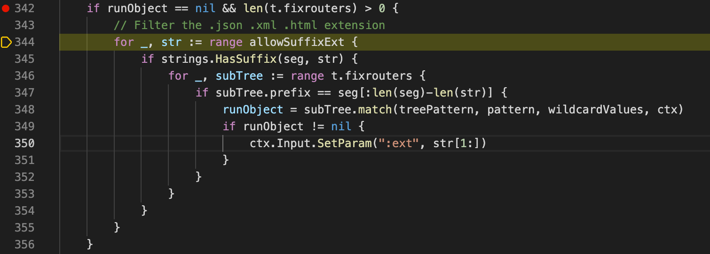

# CVE-2021-30080 beego access control bypass

## 漏洞信息
- 漏洞类型：路由绕过
- 漏洞版本：beego < 2.0.2, beego/v2 >= 2.0.0, < 2.0.2
- 漏洞简介：

## repo介绍
beego是一个go语言的web框架，目前在github上已经有28.1k个star

## 漏洞分析
漏洞代码位于[server/web/tree.go](https://github.com/beego/beego/blob/develop/server/web/tree.go#L292)，这里负责控制beego的路由添加和判断。


在漏洞位置打上断点。先创建一个路由
```go
beego.Router("/abc/aaa", &controllers.BypassController{})
```
请求`/adc.html/aaa`路由，走到下面的位置断下，可以看到在路由匹配前进行了处理，去掉每一段里面的后缀



所以最后匹配的时候只能看到`/abc/aaa`。但是这个漏洞不能用来绕过beego自带的filter，因为每次进行匹配前，使用的patten都是`/adc.html/aaa`，都会经过处理得到`/abc/aaa`再对filter或者是router进行匹配

## 修复方式
添加判断，只有后缀在URL的最后才后替换为空


## 参考链接
- https://github.com/advisories/GHSA-28r6-jm5h-mrgg