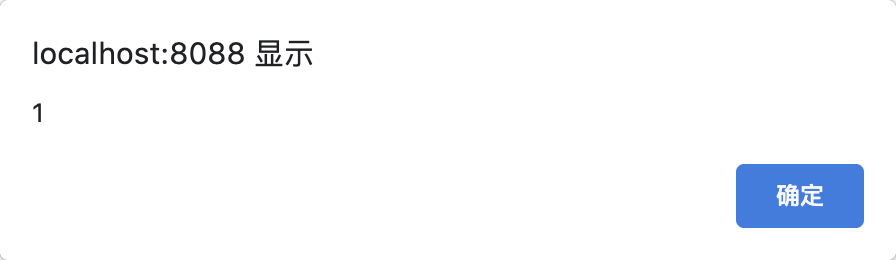

# CVE-2021-39391 beego xss

## 漏洞信息
- 漏洞类型：存储型XSS
- 漏洞版本：beego v2.0.1
- 漏洞简介：管理员面板存在未过滤的URI记录

## repo介绍
beego是一个go语言的web框架，目前在github上已经有28.1k个star

## 漏洞分析
使用`beego`搭建一个项目，然后在配置文件`conf/app.conf`里面添加配置项
```conf
EnableAdmin = true
```
然后启动项目，服务器会监听一个业务端口，和一个管理员端口，这里管理员端口默认是8088


访问业务端口如下路径
```
/<script>alert(1)</script>
```
然后回到管理员面板，点击`Requests statistics`查看请求信息，即会弹框



## 修复方式
在[server/web/statistics.go](https://github.com/beego/beego/pull/4729/files#diff-a855cebfd6acbe0bbe28f3ca2af03b874f76182b744366c151e7a185634873b8R102)作出修复，构建输出数据时，使用`template.HTMLEscapeString`进行转义


## 参考链接
- https://github.com/advisories/GHSA-c77f-4rgj-jfr4