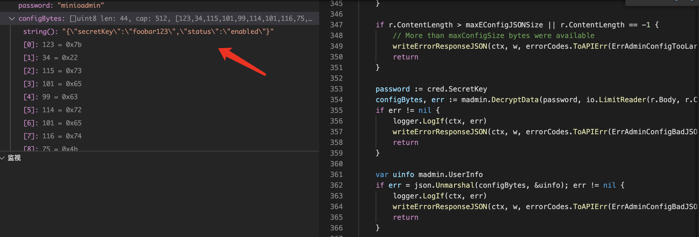
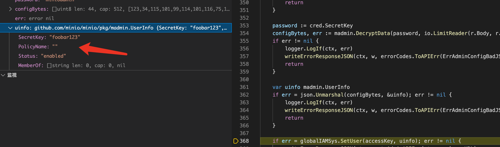
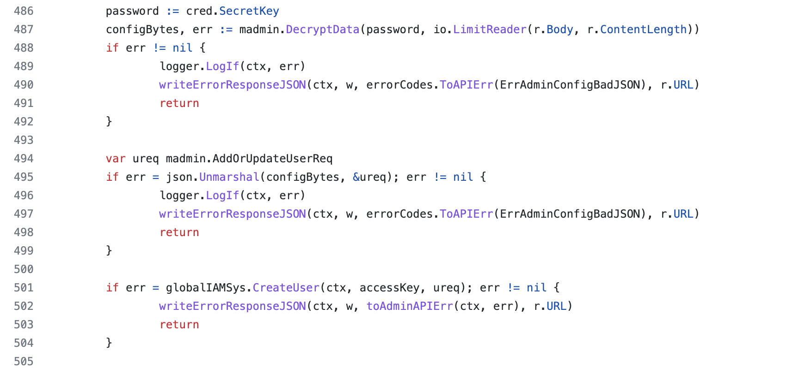

# CVE-2021-43858 minio privilege escalation

## 漏洞信息
- 漏洞类型：权限提升
- 漏洞版本：RELEASE.2019-07-31T18-57-56Z
- 漏洞简介：反序列化可以设置用户策略字段，导致权限提升

## repo介绍
minio是一个提供存储桶功能的服务器，目前在github上已有33k个star

## 漏洞分析
简要的调试分析，在[cmd/admin-handlers-users.go](https://github.com/minio/minio/blob/master/cmd/admin-handlers-users.go)处理增加/更新用户的逻辑。
```go
// AddUser - PUT /minio/admin/v3/add-user?accessKey=<access_key>
func (a adminAPIHandlers) AddUser(w http.ResponseWriter, r *http.Request) {
	ctx := newContext(r, w, "AddUser")

	objectAPI, cred := validateAdminUsersReq(ctx, w, r, iampolicy.CreateUserAdminAction)
	if objectAPI == nil {
		return
	}

    ...

	password := cred.SecretKey
	configBytes, err := madmin.DecryptData(password, io.LimitReader(r.Body, r.ContentLength))
	if err != nil {
		logger.LogIf(ctx, err)
		writeErrorResponseJSON(ctx, w, errorCodes.ToAPIErr(ErrAdminConfigBadJSON), r.URL)
		return
	}

	var uinfo madmin.UserInfo
	if err = json.Unmarshal(configBytes, &uinfo); err != nil {
		logger.LogIf(ctx, err)
		writeErrorResponseJSON(ctx, w, errorCodes.ToAPIErr(ErrAdminConfigBadJSON), r.URL)
		return
	}

	if err = globalIAMSys.SetUser(accessKey, uinfo); err != nil {
		writeErrorResponseJSON(ctx, w, toAdminAPIErr(ctx, err), r.URL)
		return
	}

    ...

}
```
这里注意到首先调用了`madmin.DecryptData`函数，从发送的数据中解密出明文



然后反序列化，赋值给`madmin.UserInfo`结构体



这里可以看出如果报文可控，那么可以控制新建的用户的参数。实际调用的加解密函数来自[encrypt.go](https://github.com/minio/madmin-go/blob/main/encrypt.go)

## 修复方式
使用一个新的结构体`madmin.AddOrUpdateUserReq`替换原来的`madmin.UserInfo`结构体



[结构体](https://github.com/minio/madmin-go/blob/7085623bda35e5f0442be13fcb0a6682daf407bb/user-commands.go)内容如下，删除了危险的字段
```go
// AddOrUpdateUserReq allows to update user details such as secret key and
// account status.
type AddOrUpdateUserReq struct {
	SecretKey string        `json:"secretKey,omitempty"`
	Status    AccountStatus `json:"status"`
}
```

参考链接
- https://github.com/minio/minio/security/advisories/GHSA-j6jc-jqqc-p6cx