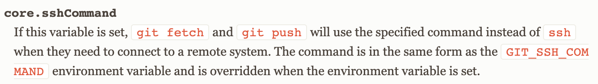
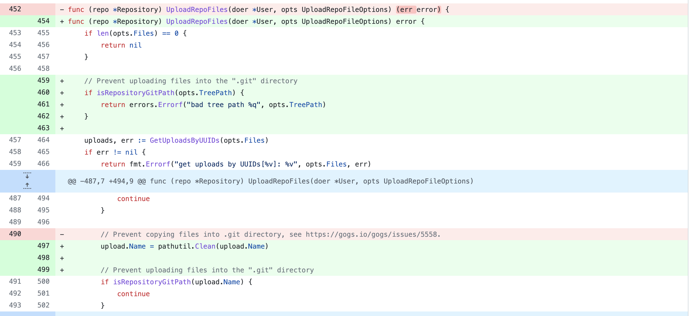

# CVE-2022-0415 gogs RCE

## 漏洞信息

- 漏洞类型：文件上传
- 漏洞版本：<0.12.6: affects versions prior to 0.12.6
- 漏洞简介：文件上传修改.git文件夹，利用sshCommand参数执行命令

## repo介绍
gogs是一个go语言实现的git服务器，目前在github上已经有39.1k个star。

## 漏洞分析

利用gogs的文件上传功能，可以上传文件。[此处](https://github.com/gogs/gogs/blob/3e353717540950a1459b3da7f28cc50df4a52119/internal/db/repo_editor.go#L490-L495)处理上传请求，利用TreePath参数控制路径，设置为`/.git/`，可以将文件上传到`/.git/`目录

```go
func (repo *Repository) UploadRepoFiles(doer *User, opts UploadRepoFileOptions) (err error) {

  ...

	uploads, err := GetUploadsByUUIDs(opts.Files)
	if err != nil {
		return fmt.Errorf("get uploads by UUIDs[%v]: %v", opts.Files, err)
	}

	...

	localPath := repo.LocalCopyPath()
	dirPath := path.Join(localPath, opts.TreePath) //利用TreePath参数控制路径
	if err = os.MkdirAll(dirPath, os.ModePerm); err != nil {
		return err
	}

	// Copy uploaded files into repository
	for _, upload := range uploads {
		tmpPath := upload.LocalPath()
		if !osutil.IsFile(tmpPath) {
			continue
		}

		// Prevent copying files into .git directory, see https://gogs.io/gogs/issues/5558.
		if isRepositoryGitPath(upload.Name) {
			continue
		}

		targetPath := path.Join(dirPath, upload.Name)
		if err = com.Copy(tmpPath, targetPath); err != nil {
			return fmt.Errorf("copy: %v", err)
		}
	}

	if err = git.RepoAdd(localPath, git.AddOptions{All: true}); err != nil {
		return fmt.Errorf("git add --all: %v", err)
	} else if err = git.RepoCommit(localPath, doer.NewGitSig(), opts.Message); err != nil {
		return fmt.Errorf("commit changes on %q: %v", localPath, err)
	}

	...
	return DeleteUploads(uploads...)
}
```
上传的文件内容如下
```ini
[core]
    repositoryformatversion = 0
    filemode = true
    bare = false
    logallrefupdates = true
    ignorecase = true
    precomposeunicode = true
    sshCommand = echo pwnned > /tmp/poc
[remote "origin"]
    url = git@github.com:torvalds/linux.git
    fetch = +refs/heads/*:refs/remotes/origin/*
[branch "master"]
    remote = origin
    merge = refs/heads/master
```
其中sshCommand配置项的文档如下

`git fetch`或`git push`指令被使用时，都会触发命令执行

## 修复方案
对treePath进行过滤，对upload.Name进行过滤

对于treePath，判断内容如下，避免写入`/.git/`目录
```go
// isRepositoryGitPath returns true if given path is or resides inside ".git" path of the repository.
func isRepositoryGitPath(path string) bool {
	return strings.HasSuffix(path, ".git") || strings.Contains(path, ".git"+string(os.PathSeparator))
}
```
对于upload.Name，判断内容如下
```go
package pathutil

import (
	"path"
	"strings"
)

// Clean cleans up given path and returns a relative path that goes straight down.
func Clean(p string) string {
	return strings.Trim(path.Clean("/"+p), "/")
}
```
## 参考链接

- https://huntr.dev/bounties/b4928cfe-4110-462f-a180-6d5673797902/
- https://www.cve.org/CVERecord?id=CVE-2022-0415
- https://git-scm.com/docs/git-config#Documentation/git-config.txt-coresshCommand