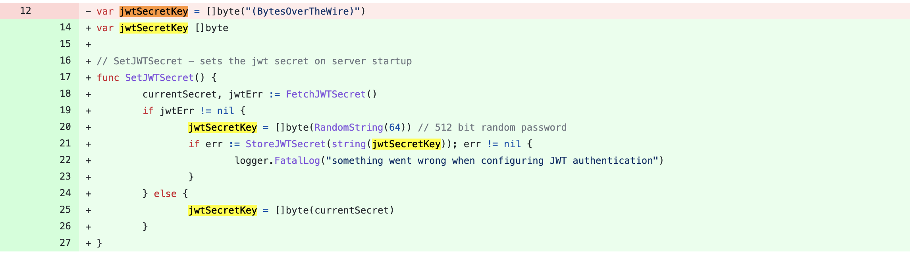
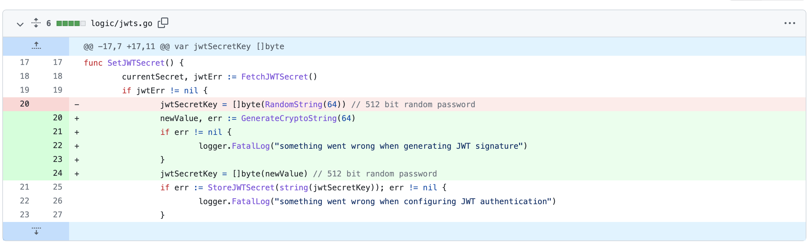

# CVE-2022-0664 netmaker hard-coded cryptographic key

## 漏洞信息

- 漏洞类型：加密key硬编码
- 漏洞版本：netmaker prior to 0.8.5,0.9.4,0.10.0,0.10.1
- 漏洞简介：硬编码导致的权限验证绕过

## repo介绍
netmaker是一个用于快速构建虚拟网络的服务器，目前在github上已经有3.8k个star

## 漏洞分析
漏洞出现在JWT处理模块，[logic/jwts.go](https://github.com/gravitl/netmaker/blob/master/logic/jwts.go)中定义了一个叫做`jwtSecrectKey`的变量，具有默认值
```go
var jwtSecretKey = []byte("(BytesOverTheWire)")
```
这个变量被用于JWT加密，导致了权限绕过漏洞

## 修复方式
仓库的维护者先后提供了两个补丁来修复这漏洞，[第一个补丁](https://github.com/gravitl/netmaker/commit/789cb27d48b0891f57b14c0ee0df8fb83b33c2ed)内容如下

可以看到首先尝试从数据库中获取JWT密钥，如果获取失败就使用了一个随机的64位字符串来作为JWT密钥。\
[第二个补丁](https://github.com/gravitl/netmaker/commit/9bee12642986cb9534e268447b70e6f0f03c59cf)内容如下

这次使用一个`GenerateCryptoString`函数来生成JWT密钥，生成函数的内容如下
```go
// GenerateCryptoString - generates random string of n length
func GenerateCryptoString(n int) (string, error) {
	const chars = "123456789ABCDEFGHIJKLMNOPQRSTUVWXYZabcdefghijklmnopqrstuvwxyz-"
	ret := make([]byte, n)
	for i := range ret {
		num, err := crand.Int(crand.Reader, big.NewInt(int64(len(chars))))
		if err != nil {
			return "", err
		}
		ret[i] = chars[num.Int64()]
	}
```

## 参考链接
- https://huntr.dev/bounties/29898a42-fd4f-4b5b-a8e3-ab573cb87eac/
- https://nvd.nist.gov/vuln/detail/CVE-2022-0664