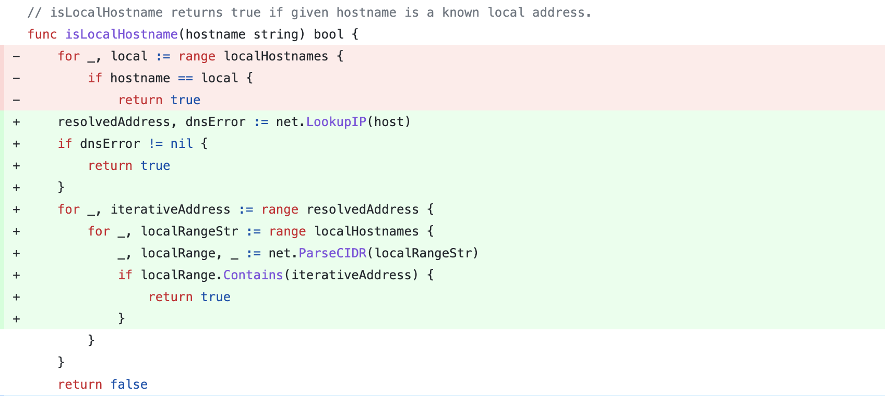
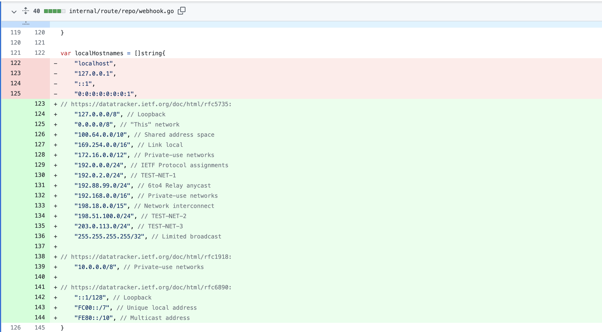

# cve-2020-0870 gogs SSRF

## 漏洞信息
- 漏洞类型：SSRF
- 漏洞版本：<0.12.5
- 漏洞简介：黑名单绕过

## repo介绍
gogs是一个go语言实现的git服务器，目前在github上已经有39.1k个star。

## 漏洞分析

提交migrate时，会触发[internal/route/repo/repo.go](https://github.com/gogs/gogs/blob/509a392272a2ba2bde9d64bf5a55a58d0eadccc4/internal/db/repo.go#L757)中的MigrateRepository方法，里面调用git.Clone方法发送了请求。

```go
// MigrateRepository migrates a existing repository from other project hosting.
func MigrateRepository(doer, owner *User, opts MigrateRepoOptions) (*Repository, error) {
	repo, err := CreateRepository(doer, owner, CreateRepoOptions{
		Name:        opts.Name,
		Description: opts.Description,
		IsPrivate:   opts.IsPrivate,
		IsUnlisted:  opts.IsUnlisted,
		IsMirror:    opts.IsMirror,
	})
	if err != nil {
		return nil, err
	}

	repoPath := RepoPath(owner.Name, opts.Name)
	wikiPath := WikiPath(owner.Name, opts.Name)

	...
  
	if err = git.Clone(opts.RemoteAddr, repoPath, git.CloneOptions{
		Mirror:  true,
		Quiet:   true,
		Timeout: migrateTimeout,
	}); err != nil {
		return repo, fmt.Errorf("clone: %v", err)
	}
  
	...
  
}
```

MigrateRepository方法被同一个文件中的MigratePost方法调用

```go
func MigratePost(c *context.Context, f form.MigrateRepo) {
	
	...
	
	remoteAddr, err := f.ParseRemoteAddr(c.User)

	...

	repo, err := db.MigrateRepository(c.User, ctxUser, db.MigrateRepoOptions{
		Name:        f.RepoName,
		Description: f.Description,
		IsPrivate:   f.Private || conf.Repository.ForcePrivate,
		IsUnlisted:  f.Unlisted,
		IsMirror:    f.Mirror,
		RemoteAddr:  remoteAddr,
	})
	if err == nil {
		log.Trace("Repository migrated [%d]: %s/%s", repo.ID, ctxUser.Name, f.RepoName)
		c.Redirect(conf.Server.Subpath + "/" + ctxUser.Name + "/" + f.RepoName)
		return
	}

	...
	
}
```

在调用之前会执行ParseRemoteAddr方法。这个方法进行了多种校验。我们关心的是调用[internal/form/repo.go](https://github.com/gogs/gogs/blob/714383a063f64fcc7c6a458182c4f9cf5a46df66/internal/form/repo.go)中的IsLocalHostname方法，检查传入的URL是否指向本地host

```go
// ParseRemoteAddr checks if given remote address is valid,
// and returns composed URL with needed username and password.
// It also checks if given user has permission when remote address
// is actually a local path.
func (f MigrateRepo) ParseRemoteAddr(user *db.User) (string, error) {
	remoteAddr := strings.TrimSpace(f.CloneAddr)

	// Remote address can be HTTP/HTTPS/Git URL or local path.
	if strings.HasPrefix(remoteAddr, "http://") ||
		strings.HasPrefix(remoteAddr, "https://") ||
		strings.HasPrefix(remoteAddr, "git://") {
		u, err := url.Parse(remoteAddr)
		if err != nil {
			return "", db.ErrInvalidCloneAddr{IsURLError: true}
		}

		if netutil.IsLocalHostname(u.Hostname(), conf.Security.LocalNetworkAllowlist) {
			return "", db.ErrInvalidCloneAddr{IsURLError: true}
		}

		if len(f.AuthUsername)+len(f.AuthPassword) > 0 {
			u.User = url.UserPassword(f.AuthUsername, f.AuthPassword)
		}
		// To prevent CRLF injection in git protocol, see https://github.com/gogs/gogs/issues/6413
		if u.Scheme == "git" && (strings.Contains(remoteAddr, "%0d") || strings.Contains(remoteAddr, "%0a")) {
			return "", db.ErrInvalidCloneAddr{IsURLError: true}
		}
		remoteAddr = u.String()
	} else if !user.CanImportLocal() {
		return "", db.ErrInvalidCloneAddr{IsPermissionDenied: true}
	} else if !com.IsDir(remoteAddr) {
		return "", db.ErrInvalidCloneAddr{IsInvalidPath: true}
	}

	return remoteAddr, nil
}
```

这个方法内容如下，红色是修复之前的，可以看到使用一个黑名单来检测host



黑名单内容如下，红色是修复之前的，可以看到不是很全




## 修复方案

修复localHostnames的黑名单。同时修复isLocalHostname，先进行dns查询，再匹配黑名单


## 参考链接

- https://huntr.dev/bounties/327797d7-ae41-498f-9bff-cc0bf98cf531/