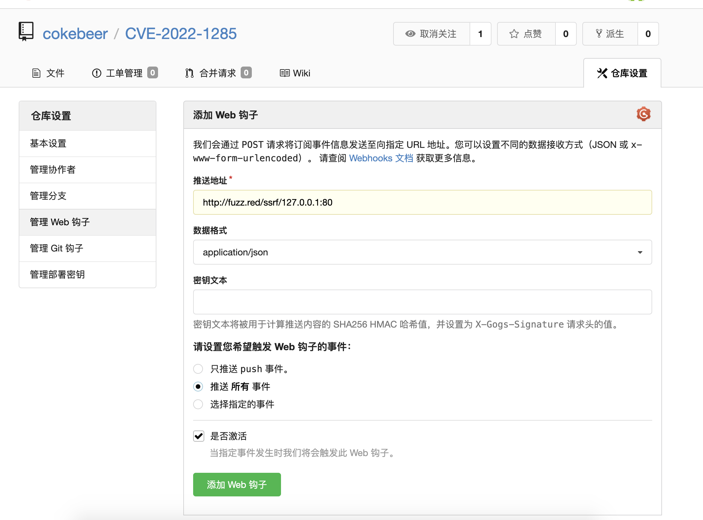
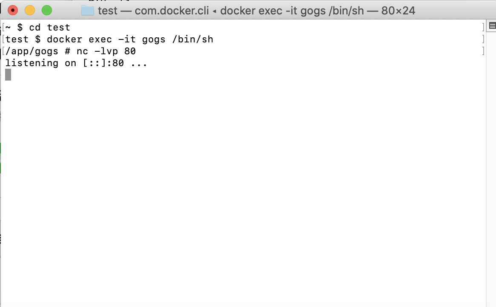
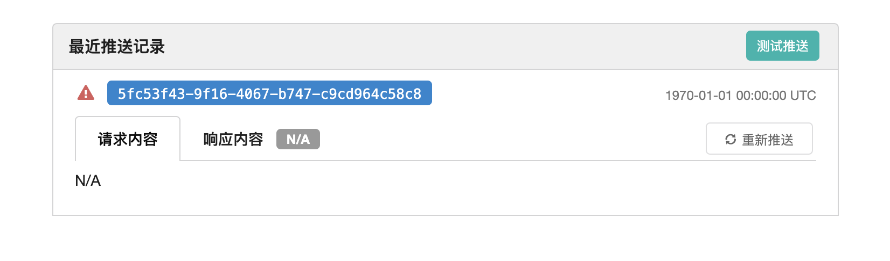
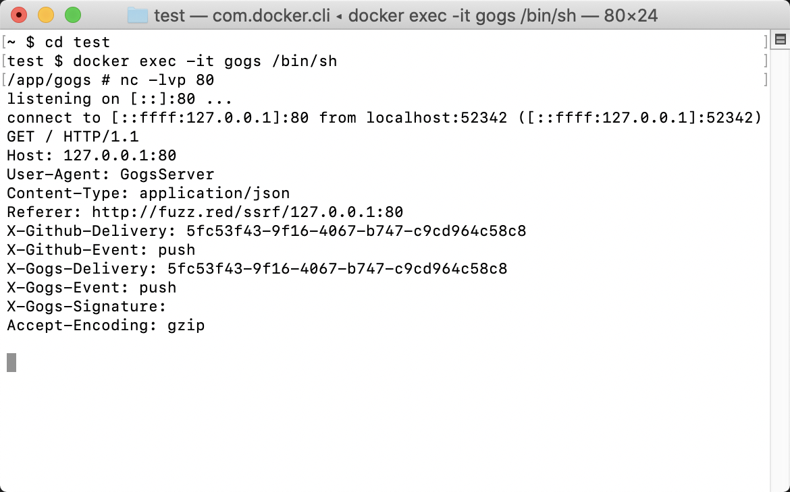

# CVE-2022-1285 gogs SSRF

## 漏洞信息
- 漏洞类型：SSRF
- 漏洞版本：<0.12.8
- 漏洞简介：黑名单绕过

## repo介绍
gogs是一个go语言实现的git服务器，目前在github上已经有39.1k个star。

## 漏洞分析
在CVE-2022-0870中，gogs对SSRF的修复方式为添加`isLocalHostname`函数进行校验。但是这种校验可以被302跳转绕过。这里先使用docker启动一个服务器
```
docker run --name=gogs -p 10022:22 -p 10880:3000 -v /tmp/gogs:/data gogs/gogs
```
注册账号登陆，创建仓库，找到仓库设置里面的web钩子功能，添加一个重定向到`127.0.0.1:80`的URL



使用nc监听docker里面的80端口



在web钩子界面点击测试推送按钮



查看nc，发现收到了请求



## 修复方式
目前还未修复

## 参考链接
- https://huntr.dev/bounties/da1fbd6e-7a02-458e-9c2e-6d226c47046d/