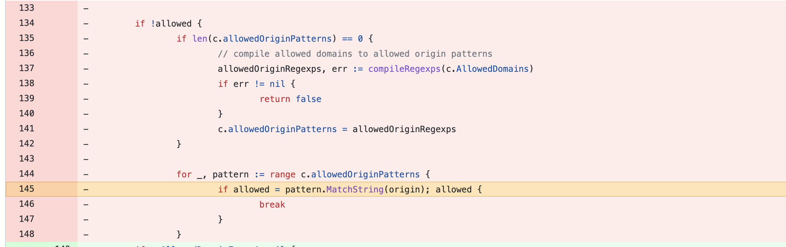
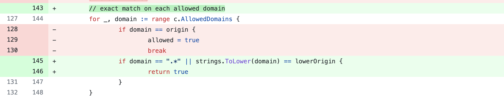

# CVE-2022-1996 go-restful access control bypass

## 漏洞信息
- 漏洞类型：访问控制绕过
- 漏洞版本：<3.8.0
- 漏洞简介：黑名单绕过

## repo介绍
go-restful是一个go语言实现的web框架，目前在github上已经有4.5k个star。

## 漏洞分析
漏洞代码位于[cors_filter.go](https://github.com/emicklei/go-restful/commit/fd3c327a379ce08c68ef18765bdc925f5d9bad10#diff-983dcf03710439f4e0c49191ae3aae1c86588eaf2a4723aa1c677e5931afec22L145)，这个文件的功能是对请求进行CORS校验。在校验域名是否在白名单里面时，使用了`pattern.MatchString`这个方法进行正则匹配

这意味着只要是名称中带有白名单字符串的域名都能通过校验，例如`whitelist.com.evil.com`

## 修复方式
进行严格的匹配

## 参考链接
- https://huntr.dev/bounties/be837427-415c-4d8c-808b-62ce20aa84f1/