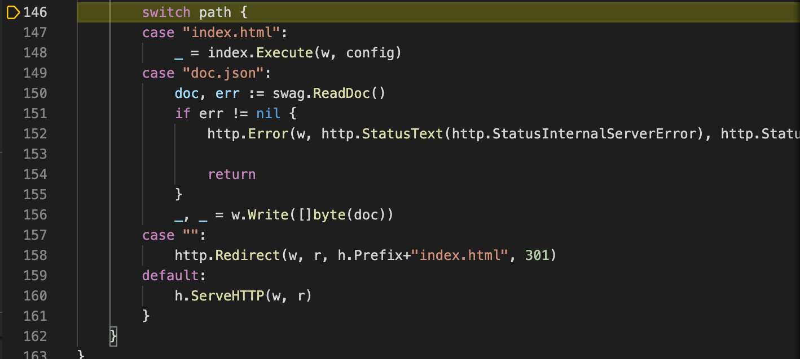
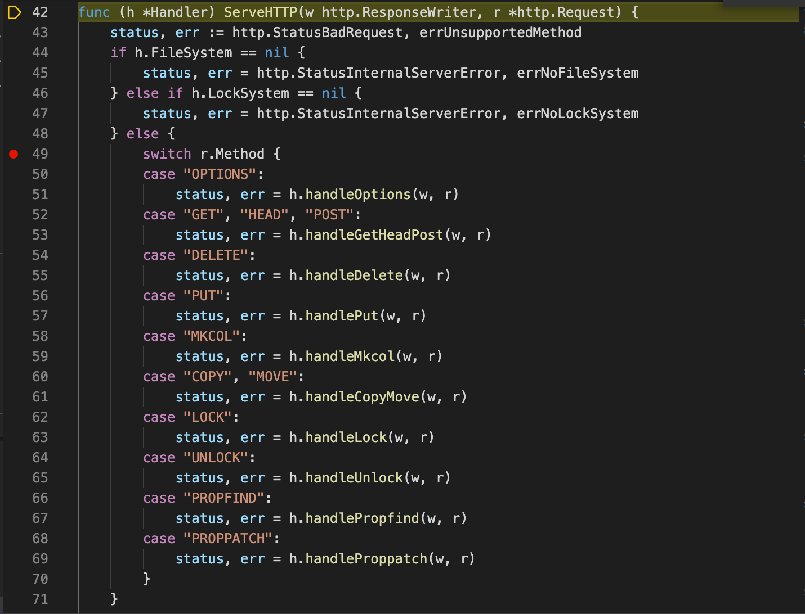
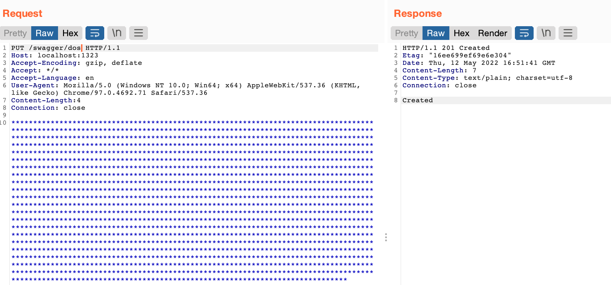
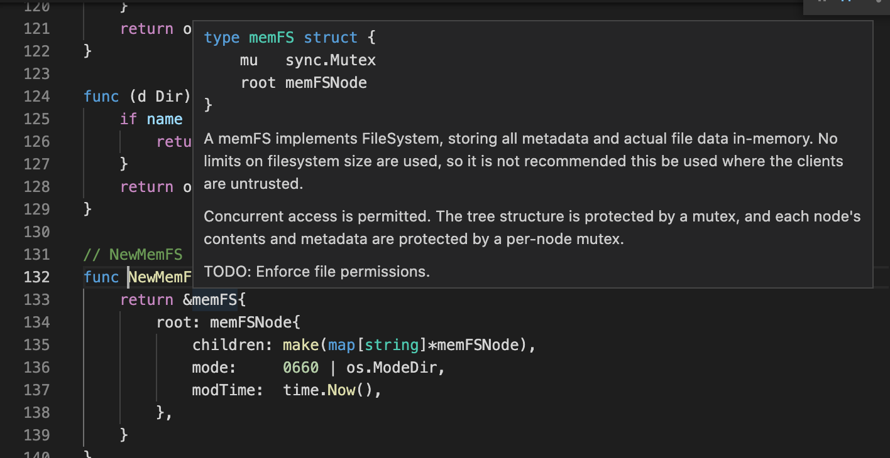
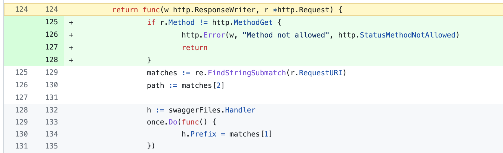

# CVE-2022-24863 http-swagger Denial of Service 

## 漏洞信息
- 漏洞类型：DoS
- 漏洞版本：< 1.2.6
- 漏洞简介：未授权访问WEBDAV导致内存资源耗尽

## 漏洞分析
调试分析。首先编写一段使用了前缀匹配的漏洞服务
```go
func main(){
	r := mux.NewRouter()

	r.PathPrefix("/swagger/").Handler(httpSwagger.Handler(
		httpSwagger.URL("http://localhost:1323/swagger/doc.json"), //The url pointing to API definition
		httpSwagger.DeepLinking(true),
		httpSwagger.DocExpansion("none"),
		httpSwagger.DomID("#swagger-ui"),
	))

	http.ListenAndServe(":1323", r)
}
```
`swaggo`在[这里](https://github.com/swaggo/http-swagger/commit/b7d83e8fba85a7a51aa7e45e8244b4173f15049e#diff-44aa764656674984f26bf27a7bcd56f8c03ea4f6b1ee8b02c48bd7e6c6c8206fR124)处理了发送到swagger路由的请求，打上断点。发送请求`/swagger/test`在这里断下。向下抵达`switch path`，这里获取到的`path`值就是`test`，可以知道会最后落入`default`



这里跟进入，发现使用了go标准库里面的`webdav.go`实现的`handler`来处理请求，可以任意访问多种方法



这里对`PUT`方法进行再测试，使用burp抓包修改为`PUT`方法，可以发送并创建大量脏数据



通过`swagger.go`中`FileSystem`的[初始化方法](https://github.com/swaggo/files/blob/master/ab0x.go#L23)检查可知数据是在内存中被创建的，所以并不能对本地文件系统进行操作



## 修复方式
增加判断，过滤除`GET`以外的其他方法



## 参考链接
- https://github.com/advisories/GHSA-xg75-q3q5-cqmv