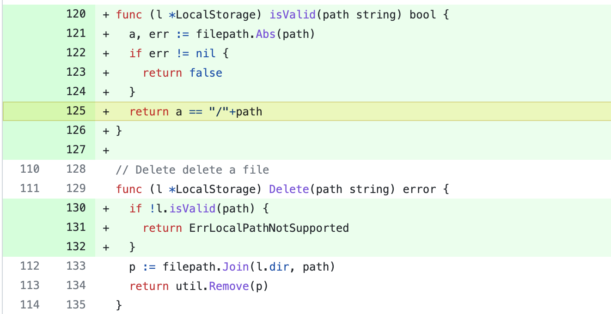

# CVE-2022-27313 gitea open redirect

## 漏洞信息

- 漏洞类型：任意文件删除
- 漏洞版本：gitea prior to 1.16.4
- 漏洞简介：未过滤导致删除功能点的目录遍历

## repo介绍
gitea是一个go语言实现的git服务器，目前在github上已经有29.7k个star。

## 漏洞分析
漏洞出现在git的LFS(large file storage)功能点上，[routers/web/repo/lfs.go](https://github.com/go-gitea/gitea/blob/main/routers/web/repo/lfs.go)处理了LFS相关的请求
```go
// LFSDelete disassociates the provided oid from the repository and if the lfs file is no longer associated with any repositories - deletes it
func LFSDelete(ctx *context.Context) {

    ...

	oid := ctx.Params("oid")

	count, err := models.RemoveLFSMetaObjectByOid(ctx.Repo.Repository.ID, oid)
	if err != nil {
		ctx.ServerError("LFSDelete", err)
		return
	}
	// FIXME: Warning: the LFS store is not locked - and can't be locked - there could be a race condition here
	// Please note a similar condition happens in models/repo.go DeleteRepository
	if count == 0 {
		oidPath := path.Join(oid[0:2], oid[2:4], oid[4:])
		err = storage.LFS.Delete(oidPath)
		if err != nil {
			ctx.ServerError("LFSDelete", err)
			return
		}
	}
	ctx.Redirect(ctx.Repo.RepoLink + "/settings/lfs")
}
```
它在[routers/web/web.go]()被绑定到路由`/{username}/{reponame}/lfs/delete/{oid}`上
```go
	m.Group("/{username}/{reponame}", func() {
        
        ...

			m.Group("/lfs", func() {
				m.Get("/", repo.LFSFiles)
				m.Get("/show/{oid}", repo.LFSFileGet)
				m.Post("/delete/{oid}", repo.LFSDelete)
				m.Get("/pointers", repo.LFSPointerFiles)
				m.Post("/pointers/associate", repo.LFSAutoAssociate)
				m.Get("/find", repo.LFSFileFind)
				m.Group("/locks", func() {
					m.Get("/", repo.LFSLocks)
					m.Post("/", repo.LFSLockFile)
					m.Post("/{lid}/unlock", repo.LFSUnlock)
				})
			})
		}, func(ctx *context.Context) {
			ctx.Data["PageIsSettings"] = true
			ctx.Data["LFSStartServer"] = setting.LFS.StartServer
		})
	}, reqSignIn, context.RepoAssignment, context.UnitTypes(), reqRepoAdmin, context.RepoRef())
        
        ...

    }
```
关键点就是这个`oid`参数。`LFSDelete`函数的代码中首先尝试在数据库中查询对应的LFS文件并删除，如果没有查询到就在本地文件系统中查询对应的LFS文件并删除。这里根据后面路径处理的逻辑，编写代码测试
```go
package main

import (
	"fmt"
	"path"
	"path/filepath"
	"strings"
)

type LocalStorage struct {
	dir    string
	tmpdir string
}

func (l *LocalStorage) buildLocalPath(p string) string {
	return filepath.Join(l.dir, path.Clean("/" + strings.ReplaceAll(p, "\\", "/"))[1:])
}

func main() {
	l := &LocalStorage{dir: "/somedir"}
	oid := "..../custom/conf/app.ini"
	oidPath := path.Join(oid[0:2], oid[2:4], oid[4:])
	delpath := l.buildLocalPath(oidPath)
	fmt.Println(delpath)
}
```
输出内容如下。说明当存储目录为`/`时，可以导致任意文件的删除。在一般情况下，可以导致相对目录下的任意文件删除。
```
/somedir/custom/conf/app.ini
```

## 修复方式
在目录操作前对路径进行有效性验证，检测是否存在目录穿越的情况


## 参考链接
- https://huntr.dev/bounties/c5ed8660-a896-4101-b6a7-05772443485b/
- https://nvd.nist.gov/vuln/detail/CVE-2022-27313