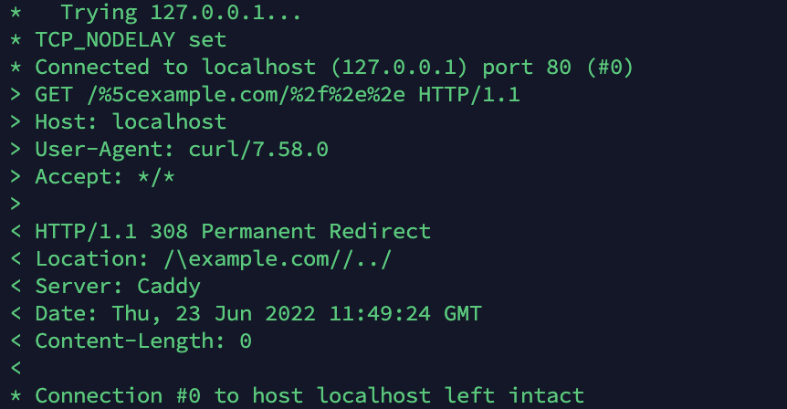
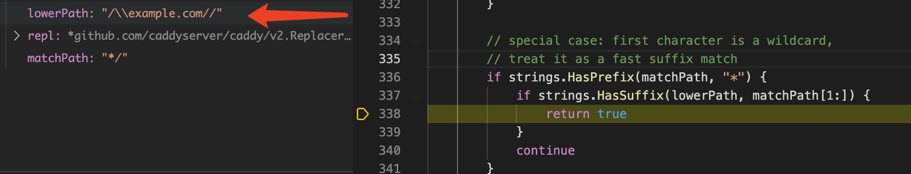
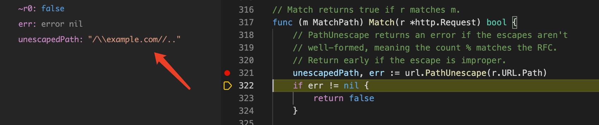
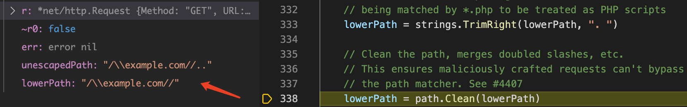
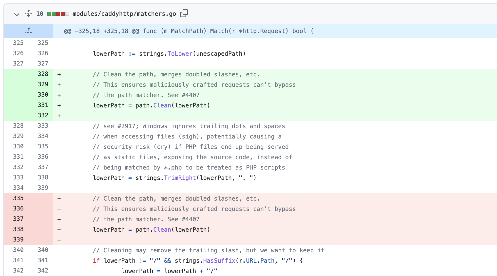

# CVE-2022-29153 caddy open redirect

## 漏洞信息
- 漏洞类型：open redirect
- 漏洞版本：v2.4.6
- 漏洞简介：php_fastcgi指令的正则化处理导致重定向

## repo介绍
caddy是一个用go语言编写的代理服务器，目前在github上已经有41.3k个star

## 漏洞分析
这里先进行漏洞复现。下载2.4.6版本的caddy服务器：`https://github.com/caddyserver/caddy/releases/download/v2.6.0/caddy_2.6.0_linux_amd64.tar.gz`
然后使用下面的文件作为Caddyfile
```
:80 {
    root * /var/www/html
    php_fastcgi unix//run/php/php7.2-fpm.sock
    file_server
}
```
启动Caddy服务器
```
sudo caddy run
```
使用curl发送请求
```
curl -v "http://localhost/%5cexample.com/%2f%2e%2e"
```
收到结果如下，可以看到出现了重定向



这里主要是因为php_fastcgi这个宏指令出现了问题。参考caddy的官方文档可以得知php_fastcgi可以展开为
```
route {
	# Add trailing slash for directory requests
	@canonicalPath {
		file {path}/index.php
		not path */
	}
	redir @canonicalPath {path}/ 308

	# If the requested file does not exist, try index files
	@indexFiles file {
		try_files {path} {path}/index.php index.php
		split_path .php
	}
	rewrite @indexFiles {http.matchers.file.relative}

	# Proxy PHP files to the FastCGI responder
	@phpFiles path *.php
	reverse_proxy @phpFiles <php-fpm_gateway> {
		transport fastcgi {
			split .php
		}
	}
}
```
这里关注第一个部分
```
	# Add trailing slash for directory requests
	@canonicalPath {
		file {path}/index.php
		not path */
	}
	redir @canonicalPath {path}/ 308
```
`@canonicalPath`表示一个匹配，当请求的url不是目录时（即最后没有斜杠），但是如果补充`/index.php`之后存在对应的索引文件，那么就对请求url进行重定向，在最后加上`/`。当发送poc时，在网页根目录下存在index.php文件，那么就会成功匹配，从而触发重定向。

## 修复方式
因为2.4.x几个版本的匹配方法编写不同，所以我测试发现只能在2.4.6版本触发这个重定向。据动态调试可知，在2.4.2版本，请求url最后的`%2e%2e`会被忽略



而在2.4.6版本中，则保留了整个请求url



2.4.6版本中继续通过`strings.TrimRight(lowerPath,". ")`，导致`..`被去掉，使得后面的`path.Clean`无法正确清理相对路径



在2.5.0版本中，先进行`path.Clean`处理路径中的`..`，避免了错误清理相对路径



## 参考链接
- https://caddy.community/t/php-fastcgi-phishing-redirection/14542/4