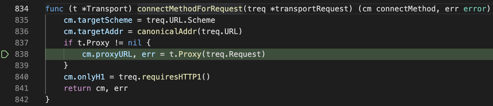
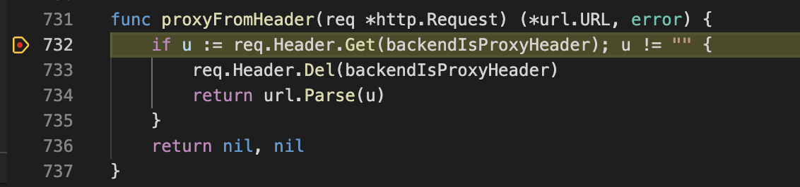
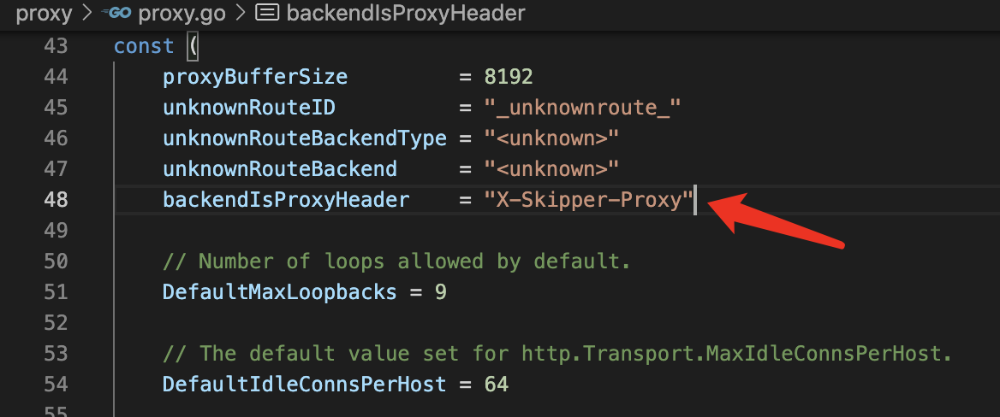
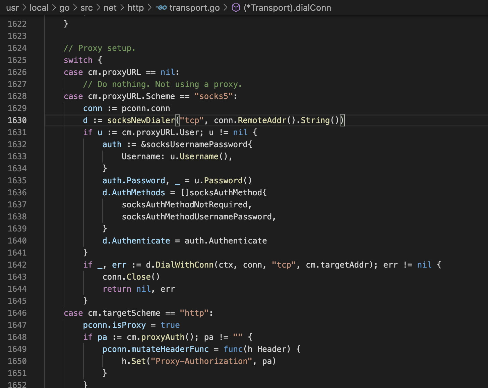
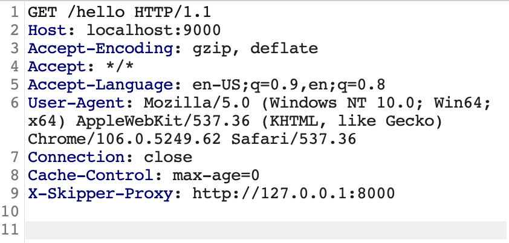
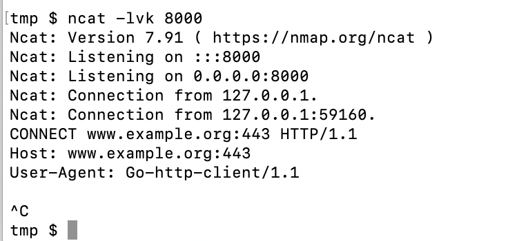

# CVE-2022-38580 skipper SSRF

## 漏洞信息
- 漏洞类型：SSRF
- 漏洞版本：skipper < 0.13.237
- 漏洞简介：特殊header可以控制转发url

## repo介绍
skipper是一个go语言实现的代理服务器，目前在github上已经有2.4k个star

## 漏洞分析
首先从github上下载[漏洞版本](https://github.com/zalando/skipper/releases/tag/v0.13.236)，进入`cmd/skipper`文件夹，编写一个配置文件`example.eskip`内容如下
```
hello: Path("/hello") -> "https://www.example.org"
```
使用如下指令启动服务器。这样`skipper`监听本地的`9000`端口，把请求`/hello`端点的报文转发给`www.example.org`
```
go run main.go -address :9000 -routes-file example.eskip
```
然后梳理请求逻辑，找到核心文件`proxy/proxy.go`，当一个请求到来时，调用的方法依次如下
```go
func (p *Proxy) do(ctx *context) error

func (p *Proxy) makeBackendRequest(ctx *context, requestContext stdlibcontext.Context) (*http.Response, *proxyError)

func (t *Transport) RoundTrip(req *Request) (*Response, error)

func (t *Transport) connectMethodForRequest(treq *transportRequest) (cm connectMethod, err error)
```
`connectMethodForRequest`方法内部进行了逻辑判断，如果`t.Proxy`不为空，就调用这个函数



这里的`Transport`结构体是在`WithParams`函数里创建的，默认的`Proxy`为`proxyFromHeader`函数
```go
func WithParams(p Params) *Proxy {
    	tr := &http.Transport{
		DialContext: newSkipperDialer(net.Dialer{
			Timeout:   p.Timeout,
			KeepAlive: p.KeepAlive,
			DualStack: p.DualStack,
		}).DialContext,
		TLSHandshakeTimeout:   p.TLSHandshakeTimeout,
		ResponseHeaderTimeout: p.ResponseHeaderTimeout,
		ExpectContinueTimeout: p.ExpectContinueTimeout,
		MaxIdleConns:          p.MaxIdleConns,
		MaxIdleConnsPerHost:   p.IdleConnectionsPerHost,
		IdleConnTimeout:       p.CloseIdleConnsPeriod,
		DisableKeepAlives:     p.DisableHTTPKeepalives,
		Proxy:                 proxyFromHeader,
	}
}
```
于是调用`proxyFromHeader`函数，可以看到其获取了`backendIsProxyHeader`头，并进行解析



我们在常量定义部分找到`backendIsProxyHeader`头的字符串值为`X-Skipper-Proxy`



接下来这个函数退出，将解析好的值返回给`cm.proxyURL`成员，`cm`是一个`connectMethod`类型的结构体，位于`net/http/transport.go`
```go
type connectMethod struct {
	_            incomparable
	proxyURL     *url.URL // nil for no proxy, else full proxy URL
	targetScheme string   // "http" or "https"
	// If proxyURL specifies an http or https proxy, and targetScheme is http (not https),
	// then targetAddr is not included in the connect method key, because the socket can
	// be reused for different targetAddr values.
	targetAddr string
	onlyH1     bool // whether to disable HTTP/2 and force HTTP/1
}
```
之后，`skipper`会使用`CONNECT`方法，向`cm.proxyURL`指向的服务器发送请求，导致SSRF

我们使用burpsuite构造一个报文，控制`skipper`转发请求到`127.0.0.1:8000`

同时在`8000`端口用`ncat`打开监听。发送请求，看到`skipper`把请求转发到了`127.0.0.1:8000`


## 修复方式
使用`proxyFromContext`替换了默认的`Proxy`函数，同时删除了`backendIsProxyHeader`头的定义
```go
func proxyFromContext(req *http.Request) (*url.URL, error) {
	proxyURL, _ := req.Context().Value(proxyUrlContextKey{}).(*url.URL)
	if proxyURL != nil {
		return proxyURL, nil
	}
	return nil, nil
}
```

## 参考链接
- https://github.com/advisories/GHSA-f2rj-m42r-6jm2
- https://github.com/zalando/skipper/pull/2058/files