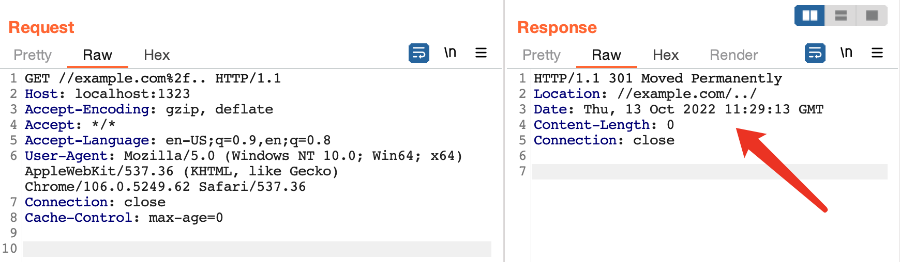
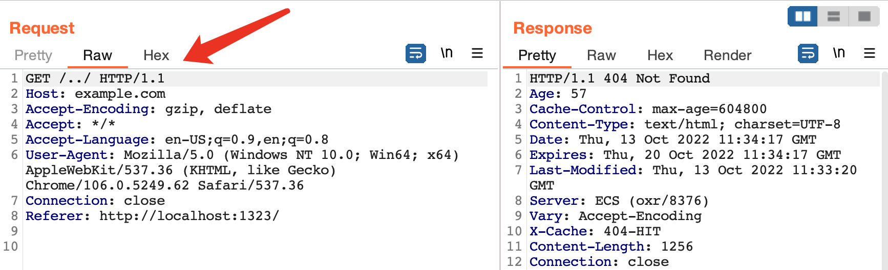
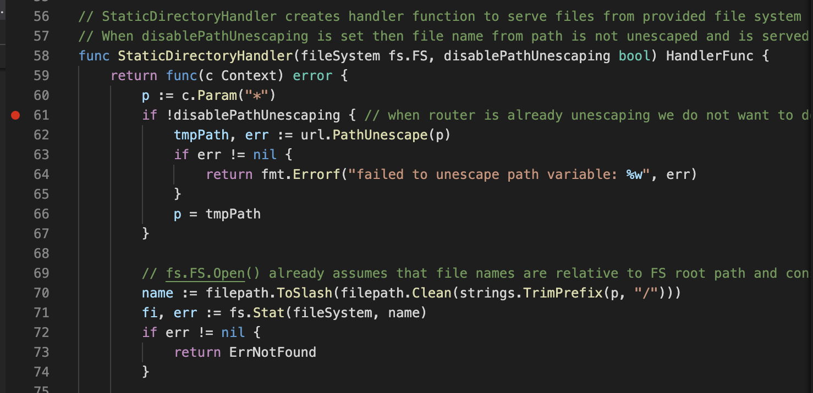
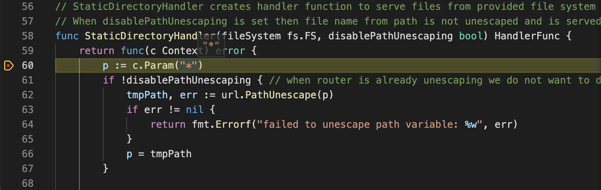
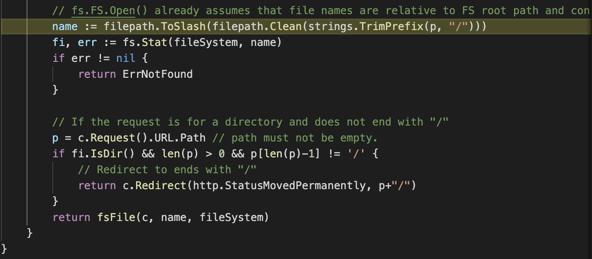

# CVE-2022-40083 echo open redirect

## 漏洞信息
- 漏洞类型： 开放式重定向
- 漏洞版本：echo < 4.9.0
- 漏洞简介：静态资源正则化导致重定向

## repo介绍
echo是一个go语言实现的web框架，目前在github上已经有24k个star

## 漏洞分析
使用漏洞报告者的issue中提供的测试代码进行复现\
这段代码的作用是在`1323`端口上开启一个`http`服务，同时将`/`路由映射到当前目录
```go
package main

import (
	"github.com/labstack/echo/v4"
)

func main() {
	e := echo.New()
	e.Static("/", "./")
	e.Logger.Fatal(e.Start(":1323"))
}
```
这是一种静态资源服务的常见写法，例如，访问`http://localhost:1323/test.html`，会返回`main.go`同一个目录下的`test.html`文件\
运行代码，此时访问`http://localhost:1323//example.com%2f..`\
可以发现`Location`字段显示将请求重定向到了`//example.com/../`

请求的最终结果是`404`

接下来进行调试分析，找到`StaticDirectoryHandler`，在其内部打上断点

发送请求，断点断下

观察代码，首先进行一次`URL`解码，得到`p="//example.com/.."`\
去掉前缀里面的`/`，然后传递给`Clean`

`Clean`的注释描述的功能如下：
1. Replace multiple Separator elements with a single one.
2. Eliminate each . path name element (the current directory).
3. Eliminate each inner .. path name element (the parent directory)\
along with the non-.. element that precedes it.
4. Eliminate .. elements that begin a rooted path:\
that is, replace "/.." by "/" at the beginning of a path,\
assuming Separator is '/'.

经过处理得到`name=.`，此时在当前目录下寻找`.`这个静态资源文件，显然是找不到的。但是可以知道`.`指向当前目录，而且不是以`/`结尾的
所以向请求`URL`的最后拼接`/`，然后进行重定向，得到`//example.com/../`

## 参考链接
- https://github.com/labstack/echo/issues/2259