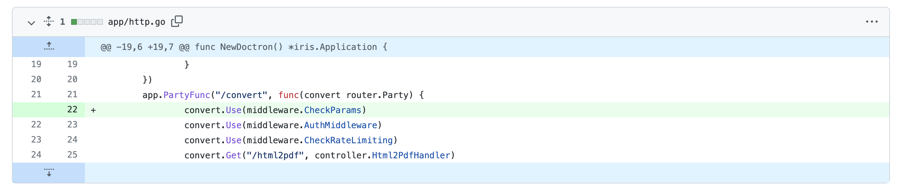

# doctron path traversal

## 漏洞信息
- 漏洞类型：目录遍历
- 漏洞版本：gitea prior to 0.2.0
- 漏洞简介：未过滤的网络请求

## repo介绍
doctron是一个提供html转pdf功能的服务器，目前已经有266个star

## 漏洞分析
doctron调用`chromedp.Navigate`发起url请求，没有对`file://`协议进行过滤，导致任意本地文件的读取
```go
func (ins *html2pdf) Convert() ([]byte, error) {
	start := time.Now()
	defer func() {
		ins.convertElapsed = time.Since(start)
	}()
	var params PDFParams
	params, ok := ins.cc.Params.(PDFParams)
	if !ok {
		return nil, errors.New("wrong pdf params given")
	}
	ctx, cancel := chromedp.NewContext(ins.ctx)
	defer cancel()

	if err := chromedp.Run(ctx,
		chromedp.Navigate(ins.cc.Url),
		chromedp.Sleep(time.Duration(params.WaitingTime)*time.Millisecond),
		chromedp.ActionFunc(func(ctx context.Context) error {
			var err error
			ins.buf, _, err = params.Do(ctx)
			return err
		}),
	); err != nil {
		return nil, err
	}

	return ins.buf, nil
}
```

## 修复方式
添加了一个`CheckParams`方法来验证url

方法内容如下，对url的协议类型进行判断和过滤
```go
func CheckParams(ctx iris.Context) {
	webUrl := ctx.URLParam("url")
    
    ...
	
    u, err := url.Parse(webUrl)

    ...

	if u.Scheme != "http" && u.Scheme != "https" {
		outputDTO := common.NewDefaultOutputDTO(nil)
		outputDTO.Code = common.InvalidUrlScheme
		_, _ = common.NewJsonOutput(ctx, outputDTO)
		return
	}

	ctx.Next()
}
```


## 参考链接
- https://huntr.dev/bounties/c1952c59-c196-440d-b41f-ce137fb183a1/